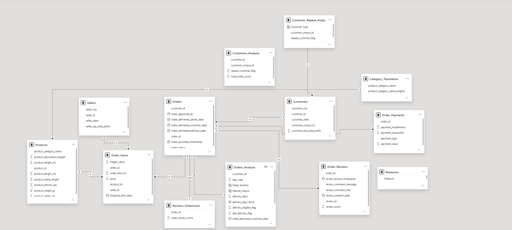
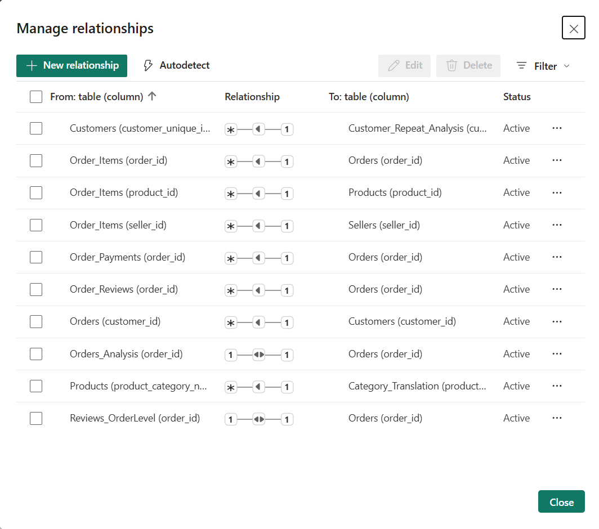
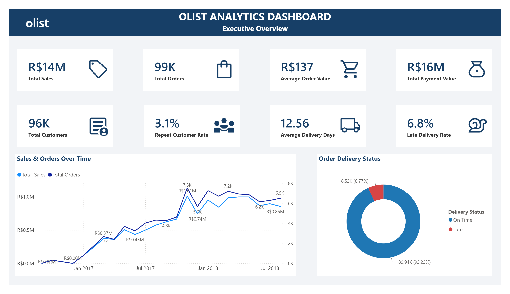
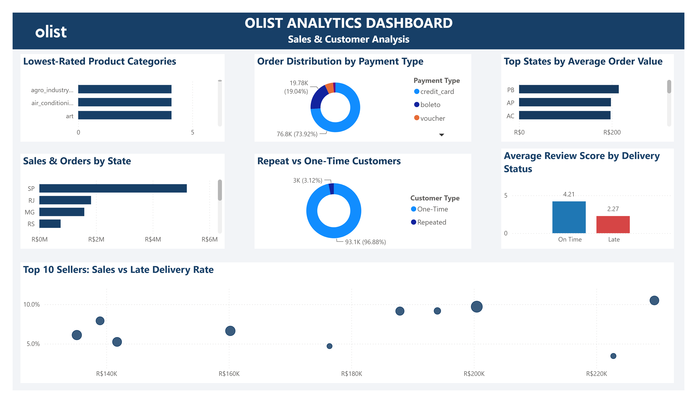
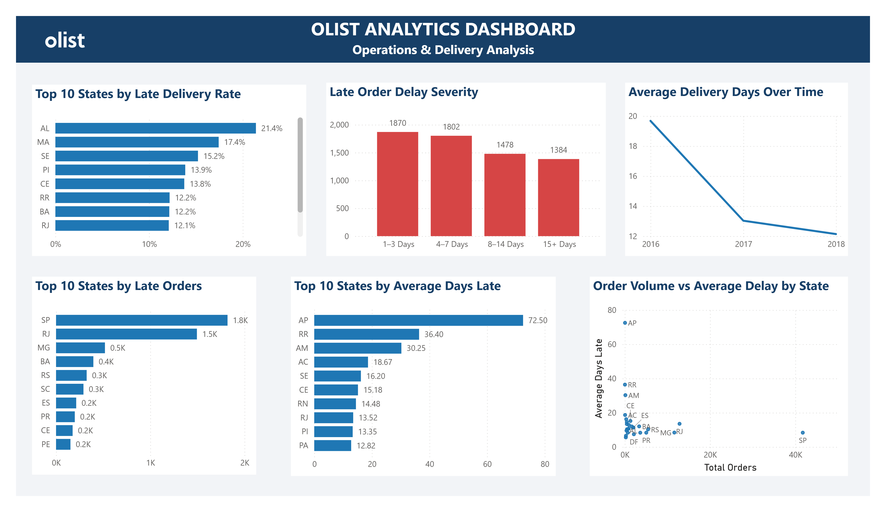

# Olist E-Commerce Sales & Customer Analytics Dashboard

A Power BI business intelligence project analyzing the Brazilian Olist e-commerce marketplace to understand sales performance, customer behavior, product and seller performance, and delivery operations.

---

## Project Overview

This project was developed as a practical data analytics portfolio project using the Brazilian E-Commerce Public Dataset by Olist.

The objective was to transform raw e-commerce data into an interactive Power BI dashboard that provides a structured view of commercial performance, customer behavior, and delivery operations.

The analysis is organized into three dashboard pages:

1. Executive Overview
2. Sales & Customer Analysis
3. Operations & Delivery Analysis

The project covers the complete analytical workflow from data preparation and transformation through data modeling, calculated measures, visualization, and business interpretation.

---

## Business Objective

The purpose of the analysis is to provide a consolidated view of Olist's marketplace performance and identify areas that may require business attention.

The dashboard focuses on questions such as:

- How are overall sales and order volumes performing?
- How do sales and orders change over time?
- Which payment methods are most frequently used?
- What proportion of customers are repeat customers?
- Which states generate the highest sales and order volumes?
- Which states have higher average order values?
- Which product categories receive lower review scores?
- How does seller sales performance relate to late delivery rates?
- Which states experience higher late-delivery rates?
- How severe are late-order delays?
- How does delivery performance change over time?
- Which states have higher average delivery delays?
- Is there a relationship between order volume and delivery delays?

---

## Dataset

The project uses the **Brazilian E-Commerce Public Dataset by Olist**, obtained from Kaggle.

**Source:** [Kaggle — Brazilian E-Commerce Public Dataset by Olist](https://www.kaggle.com/datasets/olistbr/brazilian-ecommerce)

The dataset contains multiple related tables covering:

- Customers
- Orders
- Order Items
- Payments
- Reviews
- Products
- Sellers
- Product Category Translations
- Geolocation

The raw data was prepared and transformed for analytical use before being modeled in Power BI.

---

## Data Preparation & Transformation

The project involved preparing the source data for analysis by:

- Reviewing the structure and contents of the source tables
- Cleaning and organizing the datasets
- Preparing fields required for analysis
- Handling data types and analytical fields
- Creating relationships between relevant datasets
- Preparing calculated measures for business metrics
- Structuring the data model for Power BI reporting

The cleaned data was then used as the foundation for the dashboard analysis.

---

## Data Model & Relationships

The Power BI model integrates multiple Olist datasets to support analysis across customers, orders, products, sellers, payments, reviews, and delivery operations.

Relationships were established using relevant business keys, including customer IDs, order IDs, product IDs, and seller IDs.

The model includes active relationships between transactional and supporting analytical tables, enabling connected analysis across different areas of the e-commerce business.

### Power BI Data Model



### Relationship Details

The relationship configuration includes active one-to-many and one-to-one relationships between the analytical tables used in the model.



---

## Dashboard

The Power BI dashboard is organized into three analytical pages.

### 1. Executive Overview

Provides a high-level summary of marketplace performance using key performance indicators and overall business trends.

**Key areas include:**

- Total Sales
- Total Orders
- Average Order Value
- Total Payment Value
- Total Customers
- Repeat Customer Rate
- Average Delivery Days
- Late Delivery Rate
- Sales & Orders Over Time
- Order Delivery Status



---

### 2. Sales & Customer Analysis

Focuses on commercial performance and customer behavior.

**Analysis includes:**

- Lowest-Rated Product Categories
- Order Distribution by Payment Type
- Top States by Average Order Value
- Sales & Orders by State
- Repeat vs One-Time Customers
- Average Review Score by Delivery Status
- Top 10 Sellers: Sales vs Late Delivery Rate



---

### 3. Operations & Delivery Analysis

Focuses on logistics and delivery performance.

**Analysis includes:**

- Top 10 States by Late Delivery Rate
- Late Order Delay Severity
- Average Delivery Days Over Time
- Top 10 States by Late Orders
- Top 10 States by Average Days Late
- Order Volume vs Average Delay by State



---

## Key Metrics

| Metric | Purpose |
|---|---|
| Total Sales | Measures overall sales value |
| Total Orders | Measures order volume |
| Average Order Value | Measures average value per order |
| Total Customers | Measures customer base size |
| Repeat Customer Rate | Measures customer retention behavior |
| Average Delivery Days | Measures delivery duration |
| Late Delivery Rate | Measures the proportion of late deliveries |
| Average Review Score | Measures customer satisfaction through reviews |

---

## Tools & Technologies

- **Power BI** — Data modeling, DAX measures, dashboard development and visualization
- **Microsoft Excel** — Data preparation and supporting analysis
- **DAX** — Business calculations and analytical measures
- **GitHub** — Version control and portfolio presentation

---

## Project Workflow

The project followed a structured analytics workflow:

```text
Raw Olist Dataset
        ↓
Data Preparation
        ↓
Data Cleaning & Transformation
        ↓
Data Modeling
        ↓
Calculated Measures
        ↓
Business Analysis
        ↓
Power BI Visualizations
        ↓
Dashboard Review & Validation
        ↓
Portfolio Documentation

---

## Author

**Abishek Ragu**  
Aspiring Data Analyst | Power BI | SQL | Excel

[GitHub Profile](https://github.com/Abishekragu)  
[LinkedIn Profile](https://www.linkedin.com/in/rabishekragu23/)